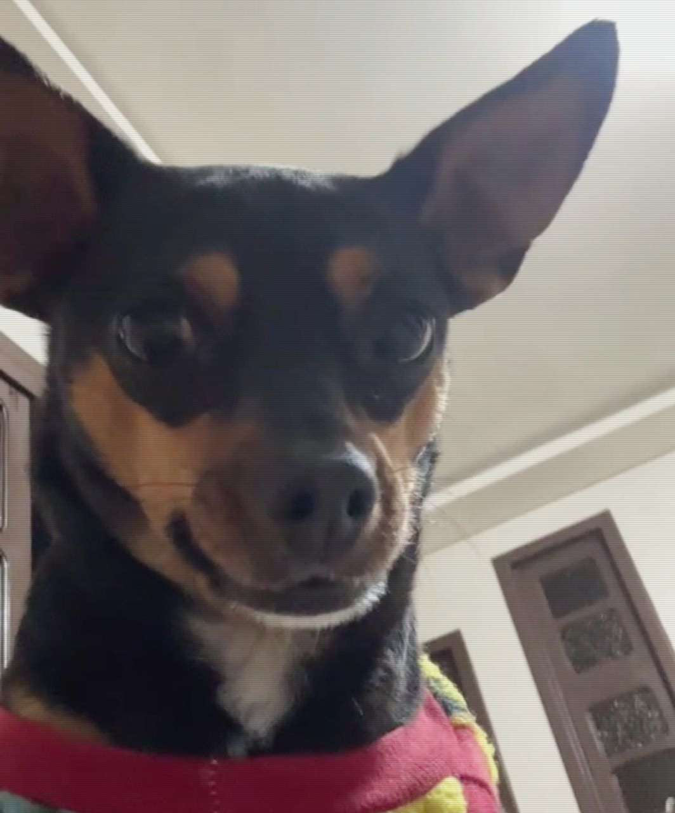

  

não sei se é sina ou overfit, 
o baralho insiste no mesmo naipe. 
mas sigo rodando o mesmo script 
até o resultado finalmente caber.

 

a build não vem pronta, vem em log, 
cada árvore de decisão, um caminho novo. 
o Louco não erra o passo, só ainda não sabe 
que dado nenhum substitui o salto.

 

Amora dorme enquanto o pipeline roda, 
o universo, hoje, é só um cron job. 
e se a carta virar Torre, nem estranha, 
reconstruir também é parte do jogo.

 

no fim é só isso: puxar a carta, 
rodar de novo, não saber ainda o motivo. 
e confiar, mesmo sem prova estatística, 
que o próximo commit é o definitivo.

